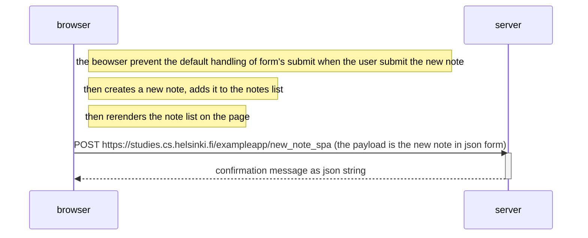

```mermaid
sequenceDiagram
    participant browser
    participant server


    Note right of browser:  the beowser prevent the default handling of form's submit when the user submit the new note
    Note right of browser:  then creates a new note, adds it to the notes list 
    Note right of browser:  then rerenders the note list on the page 
    browser->>server: POST https://studies.cs.helsinki.fi/exampleapp/new_note_spa (the payload is the new note in json form)

    activate server
    server-->>browser: confirmation message as json string 
    deactivate server

```
